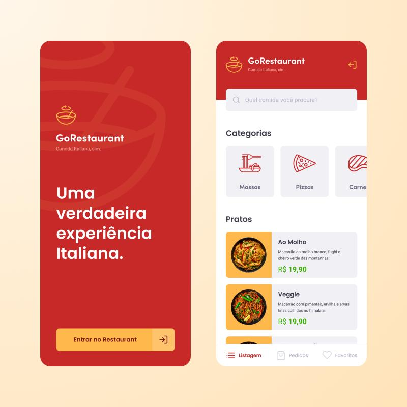

# GoRestaurant app concept style. Made with Flutter

## ScreenShots:
&nbsp;&nbsp;

## I took the original design prototype in Linkedin made by Tiago Luchtenberg
https://www.linkedin.com/posts/tiago-luchtenberg-0b9a3b97_uiux-uidesign-uxdesign-activity-6676613806258475008-jh3i
 
### Show some :heart: and star the repo to support the project or :smile:[Follow Me](https://github.com/marcioquimbundo).Thanks!
     
